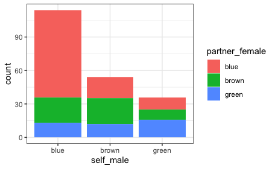

# Eye color of couples

**Description**: Colors of the eye colors of male and female partners. A data frame with 204 observations on the following 2 variables

`self_male`: a factor with levels 'blue', 'brown', and 'green'

`partner_female`: a factor with 'blue', 'brown', and 'green'

Data can be found in the library ``openintro``

**Source**

<a href="https://link.springer.com/article/10.1007/s00265-006-0266-1">B. Laeng et al. Why do blue-eyed men prefer women with the same eye color? In: Behavioral Ecology and Sociobiology 61.3 (2007), pp. 371-384.</a>


**Abstract**
The human eye color blue reflects a simple, predictable, and reliable genetic mechanism of inheritance. Blue-eyed individuals represent a unique condition, as in their case there is always direct concordance between the genotype and phenotype. On the other hand, heterozygous brown-eyed individuals carry an allele that is not concordant with the observed eye color. Hence, eye color can provide a highly visible and salient cue to the child’s heredity. If men choose women with characteristics that promote the assurance of paternity, then blue-eyed men should prefer and feel more attracted towards women with blue eyes. To test these predictions, close-up photos of young women and adult men with either blue or brown eyes were rated for their attractiveness by young women and men observers with either blue or brown eyes (N=88). The eye color in the photographs of each model was manipulated so that a same face would be shown with either the natural eye color (e.g., blue) or with the other color (e.g., brown). Both blue-eyed and brown-eyed female participants showed no difference in their attractiveness ratings for male models of either eye color. Similarly, brown-eyed men showed no preference for either blue-eyed or brown-eyed female models. However, blue-eyed men rated as more attractive the blue-eyed women than the brown-eyed ones. We interpret the latter preference in terms of specific mate selective choice of blue-eyed men, reflecting strategies for reducing paternity uncertainty. In a second study, a group of young adults (N=443) of both sexes and different eye colors (blue, brown, and green) were asked to report the eye and hair color of their romantic partners. Their responses indicated the presence of assortative mating by eye color as well as, to a less degree, for hair color. Most importantly, blue-eyed male respondents were the group with the largest proportion of partners of same eye color. These findings 1) indicate that blue-eyed men do prefer women with the same eye color and 2) specifically suggest the presence of a male adaptation for the detection of extra-pair paternity based on eye color, as a phenotypically based assurance of paternity (i.e., when the father’s and offspring’s phenotypes match) as well as a defense against cuckoldry (i.e., when the phenotypes do not match).

Get table with the data in R:

```{r}
library(openintro)
table(assortive_mating)
```
Output:

```diff
#         blue brown green
#  blue    78    23    13
#  brown   19    23    12
#  green   11     9    16
```


Pearson's Chi-squared test 
------------------------------------------------------------
Chi^2 =  33.70218     d.f. =  4     p =  8.576896e-07 


```diff
- text in red
+ text in green
! text in orange
# text in gray
@@ text in purple (and bold)@@
```
